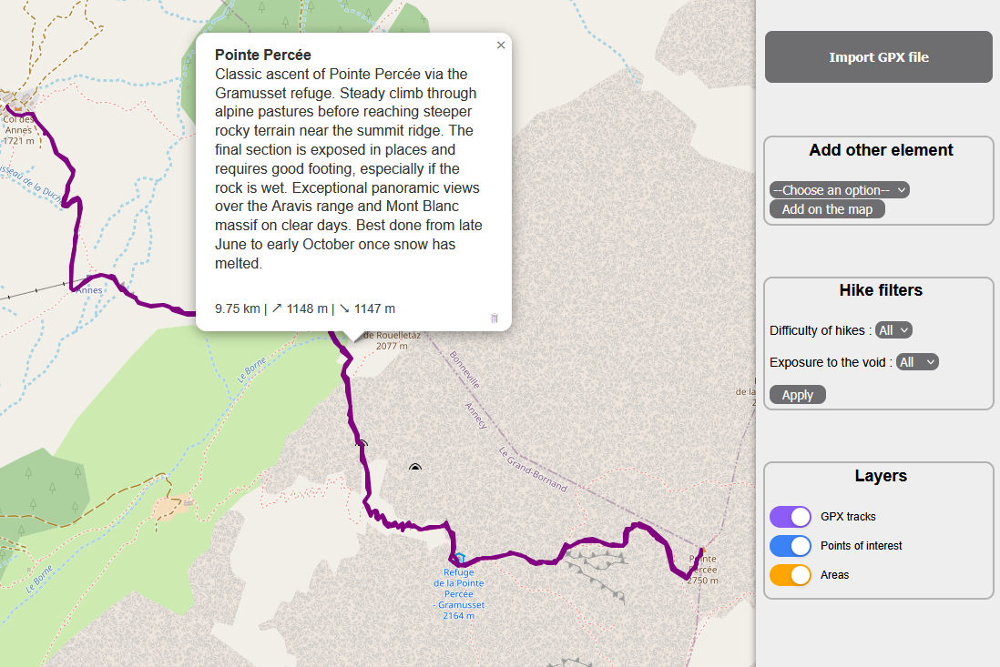

<p align="center">
  
</p>

A self-hosted app to archive your outdoor adventures — hikes, climbs, scrambles, and everything in between. Import your GPX tracks, attach photos, write notes, and browse everything on an interactive map. Your data lives on your own machine. 

## Features

- Import and view GPX tracks
- Create points of interest and areas
- Add descriptions, photos and metadata to each entry
- Use filtering options
- Find places with the search bar
- Responsive interface — works on desktop and mobile

<p align="center">
  
</p>

## Usage

The only prerequisite is [Docker](https://docs.docker.com/get-started/get-docker/). No API key or external account required.

```bash
git clone https://github.com/TheoFABIEN/My-Outdoor-Archive.git
cd My-Outdoor-Archive
docker compose up -d
```
Then open [http://localhost:3000](http://localhost:3000) in your browser. That's it.

## Data & Privacy

Everything stays on your machine. No account, no cloud sync, not telemetry. The map tiles come from OpenStreetMap and that is the only third-party service involved.
