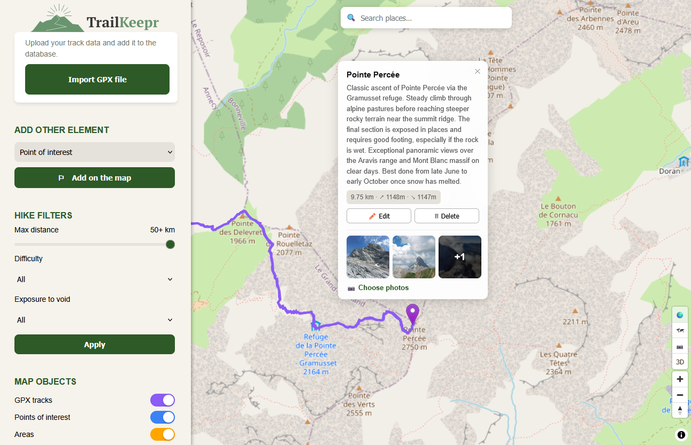

<p align="center">
<picture>
  <source media="(prefers-color-scheme: dark)" srcset="images/banner-dark.svg">
  <source media="(prefers-color-scheme: light)" srcset="images/banner-light.svg">
  
</picture>
</p>

<br>

A self-hosted app to archive your outdoor adventures — hikes, climbs, scrambles, and everything in between. Import your GPX tracks, attach photos, write notes, and browse everything on an interactive map. Your data lives on your own machine.

## Features

- Import and view GPX tracks
- Create points of interest and areas
- Add descriptions, photos and metadata to each entry
- Use filtering options
- Find places with the search bar
- Responsive interface — works on desktop and mobile

<p align="center">
  
</p>

## Usage

The only prerequisite is [Docker](https://docs.docker.com/get-started/get-docker/). No API key or external account required.

```bash
git clone https://github.com/TheoFABIEN/Trailkeepr.git
cd Trailkeepr
docker compose up -d
```

Then open [http://localhost:3000](http://localhost:3000) in your browser. That's it.

## Configuration (optional)

### Database credentials

By default, the app uses the following credentials to connect to the database:

| Variable            | Default    |
|---------------------|------------|
| `POSTGRES_USER`     | `postgres` |
| `POSTGRES_PASSWORD` | `changeme` |
| `POSTGRES_DB`       | `hiking`   |

These defaults work out of the box — no configuration needed for a standard local setup.

If you really want to use your own credentials, create a `.env` file from the provided `.env.example` before starting the app for the first time:

```bash
cp .env.example .env
```
Then edit .env with your own values.

> ⚠️ **Credentials must be set before the first `docker compose up -d`.** The database is initialized once on first launch. If you change credentials in `.env` after the database has already been created, the app will fail to connect. To reset, you will need to delete the existing data volume and recreate it:
>
> ```bash
> docker compose down -v
> rm -rf ./data
> docker compose up -d
> ```
>
> <ins>**This will permanently delete all your archived hikes, points, and photos.**</ins> Make sure to back up anything important before doing this.


## Data & Privacy

Everything stays on your machine. No account, no cloud sync, not telemetry. The map tiles come from OpenStreetMap and that is the only third-party service involved.
