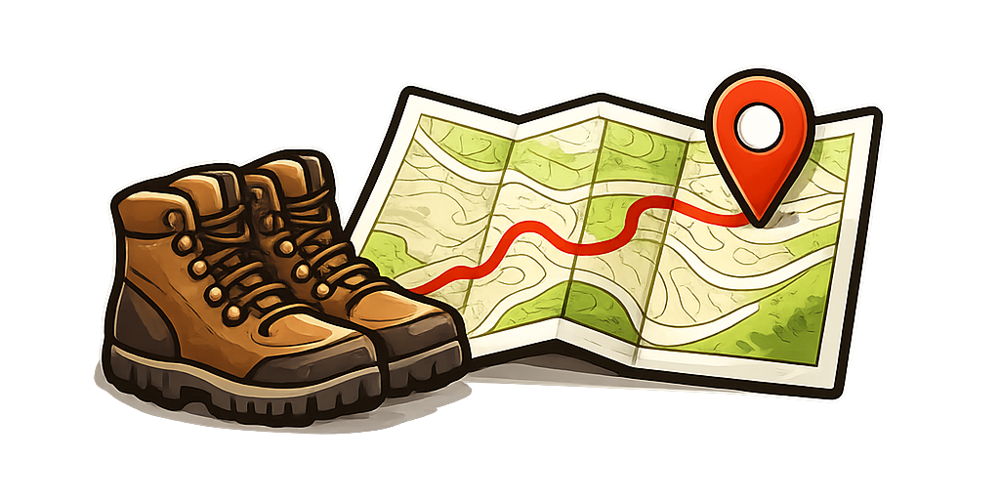

  
  <h2 align="center">My Outdoor Archive</h2>

  <h2>What are we talking about ?</h2>
  This work aims to provide a self-hosted solution for storing your outdoor memories. Use the interactive map to place your favourite hiking or climbing spots and add information you want to remember about these places.
  <h2>How to install ?</h2>
  Install on your NAS or every other home server using Docker Compose. After cloning the repo, just enter the command:
  
  <code>docker compose up --build -d</code>

